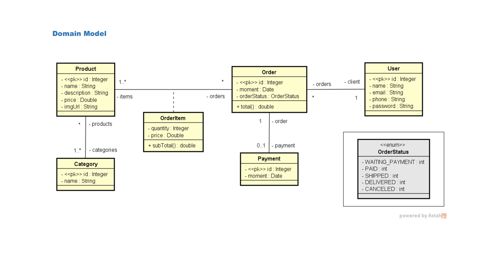

## Tecnologias

- Java 17
- Spring Boot
- JPA / Hibernate
- H2 (ou MySQL/PostgreSQL)
- Maven

## Como rodar

1. Clone o repositório:
2. Importe no STS como projeto Maven.
3. Execute a classe `MyprojectApplication.java`.

## Imagem de exemplo

## 🧩 Dependências (Maven)

<dependency>
  <groupId>org.springframework.boot</groupId>
  <artifactId>spring-boot-starter-data-jpa</artifactId>
</dependency>

<dependency>
  <groupId>com.h2database</groupId>
  <artifactId>h2</artifactId>
  <scope>runtime</scope>
</dependency>

## ⚙️ application.properties

spring.profiles.active=test  
spring.jpa.open-in-view=true

## 🧪 application-test.properties
# H2 CLIENT
spring.h2.console.enabled=true  
spring.h2.console.path=/h2-console

# JPA / SQL
spring.jpa.database-platform=org.hibernate.dialect.H2Dialect  
spring.jpa.defer-datasource-initialization=true  
spring.jpa.show-sql=true  
spring.jpa.properties.hibernate.format_sql=true

# DATASOURCE
spring.datasource.driverClassName=org.h2.Driver  
spring.datasource.url=jdbc:h2:mem:testdb  
spring.datasource.username=sa  
spring.datasource.password=

